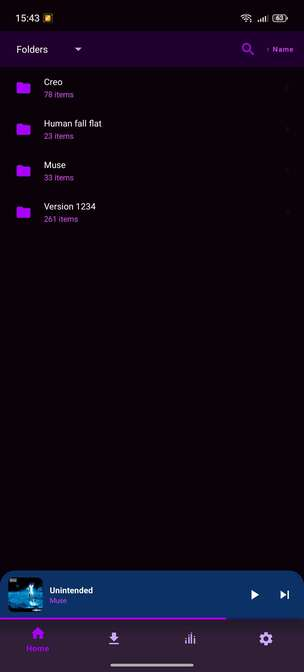
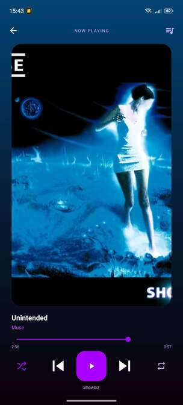
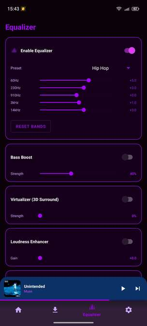
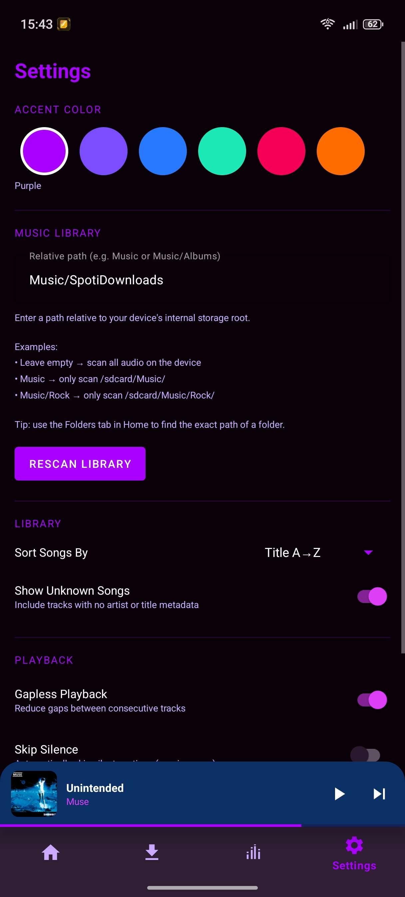

# HexaPlayer

A **free**, open-source music player for Android.


## Features

- **Browse** your library by Songs, Albums, Artists, Playlists, or Folders
- **Full-screen player** with seekbar, shuffle, repeat, and queue view
- **Queue management** — Play Next, Add to Queue, reorder with drag-and-drop; clicking a song queues the rest of the album automatically
- **Playlists** — create with a custom cover image, add/remove songs
- **Search & sort** across all views
- **Equaliser** — 10-band EQ, bass boost, virtualizer, loudness enhancer, and reverb
- **Sleep timer** — stop playback after a preset time (15 / 30 / 45 / 60 min) or a custom duration (10 s – 10 h)
- **Lyrics** — synced (LRC) and plain lyrics via [LRCLIB](https://lrclib.net), displayed in the full-screen player
- **Song metadata editing** — edit title, artist, and album directly from the 3-dot menu
- **Downloader** — download songs directly in the app by title, style, or artist
- **Accent themes** — 6 color presets to match your style

## Screenshots









## Planned Features

- **Android Auto** — control playback from your car
- **Auto-updates** — no more manual updates
- **Widgets** — add a widget to your home screen
- **Shazam** integration
- **Discord Richpresence** integration (because why not)
- **Wrapped** — a resume of the year

## Tech Stack

| Layer | Library |
|---|---|
| Language | Kotlin 2.1.0 |
| UI | Views + ViewBinding (no Compose) |
| Media | Media3 ExoPlayer + MediaSession |
| Image loading | Coil 2.7.0 |
| Persistence | SharedPreferences + Gson |
| Architecture | MVVM — ViewModel + LiveData + Repository |

## Requirements

- Android 8.1+ (minSdk 27)
- `READ_MEDIA_AUDIO` (API 33+) or `READ_EXTERNAL_STORAGE` (API 27–32)

## Building

1. Clone the repo
2. Open in Android Studio (Hedgehog or newer)
3. `Build → Make Project` — no extra setup needed

```bash
git clone https://github.com/OxoGhost01/HexaPlayer.git
```

## License

[Non-Commercial License](LICENSE) — free to use and modify for any non-commercial purpose.
